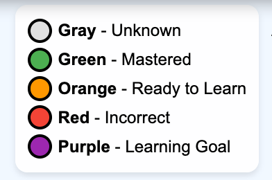

# Adaptive Assessments

This section covers the process of recommending content for a student based on the the assessment
questions they have answered.  Adaptive assessment are an optimized method for placing students at the optimal "ready-to-learn" position on their personal learning graph through intelligent, minimal questioning.

## Introduction

Adaptive assessment is a cornerstone of intelligent textbooks at Level 3 and above. Unlike traditional assessments that test all students on identical content, adaptive assessments dynamically adjust questions based on student responses to efficiently map each learner's knowledge state onto a learning graph. The goal is to determine, with minimal questions, exactly which concepts a student has mastered and which they are ready to learn next.  This is step 1.  Step 2 is to then recommend content
for their age group and reading level that will help them master this concept.

This chapter explores the theory, algorithms, and implementation strategies for building adaptive assessment systems that respect student time while providing accurate placement on personalized learning paths.

## The Learning Graph as Assessment Foundation

Every intelligent textbook has a learning graph.  We can call this the course learning graph.  This is a list of the core concepts taught in a course
that should be mastered in order for a student to pass the course.  This is another way of saying
they have mastered all the concepts in a course.

Level 3 textbooks add state information to each node node of the course learning graph for each student.
When we combine the course graph with the student state information we create a new type of graph we
call a personal learning graph.  By coloring each state with different colors we can learn to visualize
how adaptive assessments are used to inform us what concepts need to be mastered next and from this
we can recommend content for each student.

### Concept Mastery State Colors

In an adaptive assessment system, each node (concept) in a student's personal learning graph exists in one of several states:

| State | Color | Description |
|-------|-------|-------------|
| **Unknown** | Gray | We have no knowledge if the student has mastered this concept |
| **Mastered** | Green | Student has demonstrated understanding of this concept |
| **Ready to Learn** | Yellow | All prerequisite concepts are green; student can begin learning this concept now |
| **Not Yet Ready** | Red | One or more prerequisites remain unmastered or an assessment has shown the student has not mastered this concept |
| **Student Goal** | Purple | The student has stated this is a goal concept they are interested in mastering. |

This traffic-light metaphor provides intuitive visualization for both students and instructors:

- **Green nodes** represent the student's current knowledge foundation.  This symbolizes a green light that the users can go down this learning path at any time.
- **Yellow nodes** form the "learning frontier" - the optimal next steps
- **Red nodes** concepts that the user has not mastered symbolizing a red stop light that prevents further travel down a learning path

In this course, you will frequently see personal learning graphs that are associated with one or more students.
These graphs will have the following legend in the graph:



### The Certainty Score

Beyond the three-state model, sophisticated systems track a **certainty score** for each concept, typically ranging from 0 to 1:

| Score Range | Interpretation |
|-------------|----------------|
| 0.0 - 0.3 | Low confidence; concept likely not mastered |
| 0.3 - 0.7 | Uncertain; additional assessment recommended |
| 0.7 - 1.0 | High confidence; concept mastered |

The certainty score enables nuanced decision-making:

- Concepts with certainty > 0.8 can be marked green with confidence
- Concepts in the 0.4-0.6 range warrant follow-up questions
- Scores decay over time to account for forgetting (spaced repetition)

### Unknown States and Goals

We will add two more colors to our graphs.

- Gray is an `unknown` state.  We don't know if the student has mastered this concept or not.
- Purple is a `goal` state.  This is a concept that the student has shown a curiosity about or has stated it is a learning objective.

Now we are ready to see how answering a question about a concept will change the state of the personal learning graph for each student.

#### Diagram: Learning Graph Question Color

<iframe src="/intelligent-textbooks/sims/question-color-update/main.html?enable-save=false" width="100%" height="680px" scrolling="no"></iframe>
[Run the Learning Graph Question Color Update MicroSim Fullscreen](../sims/question-color-update/main.html?enable-save=false)

To use this MicroSim, click on a node in the graph such as the `Term` node.  Note that the panel to the right of the graph
now allows you to indicate if a student got an assessment question correct or incorrect.  If you click `correct` the
node will turn green, indicating that the student has mastered the concept.  Note that the nodes that depend on the `Term` concept
have also changed from Gray to Orange, indicating that the student is ready to learn these concepts.  All the concepts that `Term` depends on also turn green, since we can infer that a student that understands what a Term in algebra is also understands its two dependant concepts: `Constants` and `Variables`.

Note that you don't need to use any complex AI or LLMs to do this analysis.  This is just simply plain old deterministic graph algorithms.  These algorithms run by simple pointer hopping and can be run directly in each students browser.  This is a key
characteristic of a level-3 textbook.

## The Adaptive Assessment Algorithm

### Core Principles

The fundamental goal of adaptive assessment is **information maximization**: each question should provide the maximum possible information about the student's knowledge state. This is achieved through several key principles:

1. **Dependency Exploitation**: If a student answers a question on an advanced concept correctly, they likely understand all prerequisites
2. **Failure Propagation**: If a student fails a foundational concept, they probably cannot master dependent concepts
3. **Uncertainty Targeting**: Questions should target concepts where certainty is lowest
4. **Efficiency Optimization**: Minimize total questions while maximizing coverage

### The Binary Search Analogy

Consider a linear chain of 8 concepts: A → B → C → D → E → F → G → H

A naive approach tests each concept sequentially (8 questions). An adaptive approach uses binary search:

1. **Question 1**: Test concept D (middle)
   - If correct: Student likely knows A, B, C, D → test F
   - If incorrect: Student may not know D or prerequisites → test B

2. **Question 2**: Narrow based on first response
3. **Continue**: Until all concepts have sufficient certainty

This reduces worst-case questions from 8 to approximately 3 questions, plus validation. The number of questions required follows:

$$
Q_{max} = \lceil \log_2(n) \rceil
$$

Where:

- $Q_{max}$ = maximum number of questions needed in worst case
- $n$ = number of concepts in the linear chain
- $\lceil \cdot \rceil$ = ceiling function (round up to nearest integer)

### The Topological Assessment Algorithm

For real learning graphs (not linear chains), the algorithm becomes more sophisticated:

```
Algorithm: Adaptive Assessment

Input: Learning graph G, target concepts T, threshold θ
Output: Mastery map M with certainty scores

1. Initialize all certainty scores to 0.5 (unknown)
2. Compute topological order of G
3. While any target concept has certainty < θ:
   a. Select question Q targeting concept with:
      - Highest uncertainty (closest to 0.5)
      - Maximum information gain potential
      - Appropriate difficulty for current state
   b. Present Q to student
   c. Update certainty scores:
      - If correct: Increase score for tested concept
                   Propagate partial credit to prerequisites
      - If incorrect: Decrease score for tested concept
                     Propagate uncertainty to dependents
   d. Apply Bayesian update to related concepts
4. Color nodes based on final certainty scores
5. Return mastery map M
```

### Bayesian Knowledge Update

When a student answers a question, we update our belief about their mastery using Bayes' theorem:

$$
P(M|R) = \frac{P(R|M) \cdot P(M)}{P(R)}
$$

Where:

- $P(M|R)$ = posterior probability of mastery given the response (updated belief)
- $P(R|M)$ = likelihood of the response given mastery
- $P(M)$ = prior probability of mastery (belief before this question)
- $P(R)$ = probability of the response (normalizing constant)

The denominator can be expanded using the law of total probability:

$$
P(R) = P(R|M) \cdot P(M) + P(R|\neg M) \cdot P(\neg M)
$$

Where:

- $P(R|\neg M)$ = likelihood of the response given non-mastery
- $P(\neg M)$ = prior probability of non-mastery (equal to $1 - P(M)$)

### Information Gain Calculation

The information gain for a potential question can be estimated using entropy. For a concept $C$, the entropy is calculated as:

$$
H(C) = -P(m) \log_2 P(m) - P(\neg m) \log_2 P(\neg m)
$$

Where:

- $H(C)$ = entropy (uncertainty) of concept $C$, measured in bits
- $P(m)$ = probability that the student has mastered the concept
- $P(\neg m)$ = probability that the student has not mastered the concept (equal to $1 - P(m)$)
- $\log_2$ = logarithm base 2

Key properties of entropy:

- Concepts with certainty near 0.5 have maximum entropy (most uncertainty): $H = 1$ bit
- Concepts with certainty near 0 or 1 have minimum entropy (already known): $H \approx 0$ bits

The optimal next question targets the concept where answering would most reduce total system entropy. The expected information gain from asking about concept $C$ is:

$$
IG(C) = H(C) - \mathbb{E}[H(C|answer)]
$$

Where:

- $IG(C)$ = information gain from testing concept $C$
- $H(C)$ = current entropy of concept $C$
- $\mathbb{E}[H(C|answer)]$ = expected entropy after receiving the student's answer

## Question Design for Adaptive Systems

### Question Types and Information Value

Different question types provide varying amounts of information:

| Question Type | Information Value | Use Case |
|--------------|-------------------|----------|
| Multiple choice (4 options) | ~2 bits max | Quick screening |
| Multiple choice (2 options) | ~1 bit max | Binary decisions |
| Free response | Variable | Deep assessment |
| Multi-select | ~n bits | Complex understanding |
| Sequencing/ordering | High | Procedural knowledge |

### Difficulty Calibration

Questions should be calibrated to Item Response Theory (IRT) parameters. The three-parameter logistic (3PL) model describes the probability of a correct response:

$$
P(\theta) = c + \frac{1 - c}{1 + e^{-a(\theta - b)}}
$$

Where:

- $P(\theta)$ = probability of correct answer given student ability $\theta$
- $\theta$ = student ability level (typically standardized, mean = 0, sd = 1)
- $a$ = discrimination parameter (how well the question differentiates ability levels)
- $b$ = difficulty parameter (the ability level at which 50% of non-guessers answer correctly)
- $c$ = guessing parameter (probability of correct answer by chance)
- $e$ = Euler's number (approximately 2.718)

High-quality adaptive assessments use questions with:

- High discrimination ($a > 1.0$)
- Varied difficulty levels (range of $b$ values)
- Minimal guessing potential ($c < 0.25$ for 4-option multiple choice)

### Diagnostic Questions

Beyond correct/incorrect, diagnostic questions reveal *why* students struggle:

```
Example: Testing understanding of "derivative"

Standard question:
  What is the derivative of f(x) = 3x²?
  a) 6x  b) 3x  c) x²  d) 6x²

Diagnostic question:
  Which step is INCORRECT in finding the derivative of f(x) = 3x²?

  Step 1: Apply power rule: bring down exponent
  Step 2: Multiply coefficient: 3 × 2 = 6
  Step 3: Reduce exponent: 2 - 1 = 1
  Step 4: Result: f'(x) = 6x¹ = 6x

  a) Step 1  b) Step 2  c) Step 3  d) No error
```

The diagnostic version reveals which sub-concept needs reinforcement.

## Visualizing the Assessment Process

### The Knowledge Map

A student's personal learning graph can be visualized as an interactive knowledge map:

```
        [Statistics]         [Probability]
              ↑                    ↑
              |                    |
        [Descriptive       [Combinatorics]
         Statistics]              ↑
              ↑                   |
              |              [Factorials]
        [Mean/Median]             ↑
              ↑                   |
              |_______    ________|
                      |  |
                 [Basic Algebra]
                       ↑
                       |
                 [Arithmetic]
```

During assessment, nodes transition from red → yellow → green as mastery is established.

### Progress Indicators

Effective adaptive assessment interfaces show:

1. **Overall progress**: Percentage of learning graph assessed
2. **Current certainty**: Confidence level for recent answers
3. **Frontier size**: Number of concepts ready to learn (yellow nodes)
4. **Path to goal**: Shortest path from current state to target concepts

## Implementation Considerations

### Cold Start Problem

New students have no prior data. Solutions include:

1. **Placement tests**: Brief initial assessments targeting key decision points
2. **Demographic priors**: Use population-level data responsibly
3. **Self-assessment**: Allow students to indicate prior knowledge
4. **Conservative starting**: Begin with foundational concepts

### Handling Inconsistent Responses

Students may answer inconsistently (know advanced concept, miss basic one):

1. **Re-testing**: Flag and re-assess suspicious patterns
2. **Weighted averaging**: Recent responses weighted more heavily
3. **Forgetting curves**: Account for knowledge decay
4. **Lucky guesses**: Require confirmation for surprise correct answers

### Stopping Criteria

When is assessment "complete enough"?

- **Coverage threshold**: X% of concepts have certainty > 0.7
- **Question budget**: Maximum N questions per session
- **Diminishing returns**: Information gain drops below threshold
- **Student fatigue**: Detected through response time patterns

## Suggested MicroSims

<diagram>
Use the vis-network-microsim skill

**Status:** Done

### 1. Learning Graph Adaptive Assessment Coloring Simulator

The following interactive simulations would effectively illustrate adaptive assessment concepts:
Use the vis-network-microsim skill to generate a new microsim called 'question-color-update' that
  will update a personal learning graph for a student based on how they answer a specific question.
  Use the @docs/sims/three-color-dfs/ as your layout template.  
  We want sample Algebra 1 topics that most readers will be familiar with
  Get a sample of about 17 nodes from the
  algebra-1 learning graph at
  /Users/dan/Documents/ws/algebra-1/docs/learning-graph/learning-graph.json
  Create short names since they will be labels inside of an ellipse in a graph with a narrow width.
  Place the nodes in a graph that is connected.  Make sure there are no orphan nodes.
  


Context: Understanding the role of answering an assessment in building a personal student learning graph
where concepts they know are green, concepts they are "ready to learn" are orange, and their stated learning
goals are red.  Nodes are only marked "ready to learn" if all their dependant concepts are green

**Concept**: Visualize how answering questions changes node colors

**Features**:
- Interactive learning graph with 15-20 nodes
- all nodes are initially gray
- Suggest a node by making it the current node
- When a user clicks on any node a radio button appears on the right side panel with a radio control
- The radio buttons values are "correct" and "incorrect"
- The user selects a correct/incorrect responses
- A correct responses turn a node green
- An incorrect response turns the node red
- Watch dependency propagation in real-time as each question is answered
- Display certainty scores on hover over each node

**Learning objective**: Understand how single answers affect multiple concepts through dependencies
</diagram>

### 2. Binary Search Assessment Demo

**Concept**: Compare naive vs. adaptive questioning strategies

**Features**:
- Linear concept chain (10 nodes)
- Side-by-side comparison of sequential vs. binary search
- Question counter for each approach
- Visualization of "search space" narrowing

**Learning objective**: Appreciate efficiency gains from adaptive algorithms

### 3. Information Gain Visualizer

**Concept**: Show entropy calculations for question selection

**Features**:
- Scatter plot of concepts by current certainty
- Highlight concept with maximum information gain
- Show entropy values updating after each answer
- Compare random vs. optimal question selection

**Learning objective**: Understand information-theoretic basis for question selection

### 4. Student Journey Simulator

**Concept**: Follow a simulated student through adaptive assessment

**Features**:
- Animated avatar moving through learning graph
- Path visualization showing assessment decisions
- Comparison with "ideal" student and "struggling" student
- Time-lapse of mastery development

**Learning objective**: See the student experience of adaptive assessment

### 5. IRT Parameter Explorer

**Concept**: Understand question quality parameters

**Features**:
- Interactive sliders for difficulty, discrimination, guessing
- Real-time Item Characteristic Curve (ICC) updates
- Simulation of student population responses
- Optimal question selection demonstration

**Learning objective**: Learn how question design affects assessment quality

## Privacy and Ethical Considerations

Adaptive assessments collect detailed student performance data:

### Data Minimization

- Collect only what's necessary for adaptation
- Aggregate when individual data isn't required
- Set retention limits appropriate to educational purpose

### Algorithmic Transparency

- Explain to students how questions are selected
- Provide access to personal mastery maps
- Allow students to contest assessments

### Avoiding Negative Labels

- Frame results as "learning opportunities" not "failures"
- Emphasize growth mindset: current state is not permanent
- Prevent self-fulfilling prophecies from premature labeling

### Bias Auditing

- Test assessment fairness across demographic groups
- Monitor for questions with differential item functioning
- Regular review of algorithm decisions

## Summary

Adaptive assessment transforms the traditional testing paradigm from "measure everything" to "measure efficiently." By leveraging the structure of learning graphs, dependency relationships, and information theory, intelligent textbooks can:

1. **Minimize assessment burden**: Fewer questions, more learning time
2. **Maximize accuracy**: Target uncertainty, not known quantities
3. **Personalize placement**: Every student starts at their optimal frontier
4. **Enable mastery-based progression**: Green-yellow-red visualization makes progress tangible

The traffic-light model—green for mastered, yellow for ready-to-learn, red for not-yet-ready—provides an intuitive framework for both students and educators to understand where learning should focus next.

## Review Questions

1. Explain the difference between the three-state (green/yellow/red) model and the continuous certainty score. When might you prefer one over the other?

2. Why does the adaptive assessment algorithm target concepts with maximum uncertainty rather than testing randomly?

3. A student correctly answers a question about "integration by parts." What can you infer about their knowledge of prerequisite concepts like "basic integration" and "product rule"?

4. Describe three strategies for handling the "cold start" problem when a new student begins adaptive assessment.

5. What ethical considerations arise when using detailed learning analytics for adaptive assessment? How can these be addressed?

## Practical Exercise

Design an adaptive assessment strategy for a 10-concept learning graph in your subject area:

1. Draw the concept dependency graph
2. Identify 2-3 "decision point" concepts that would divide the graph efficiently
3. Write diagnostic questions for each decision point
4. Specify your stopping criteria (when is assessment complete?)
5. Plan your cold-start strategy for new students

## References

### Foundational Works

1. Lord, F. M. (1980). *Applications of Item Response Theory to Practical Testing Problems*. Lawrence Erlbaum Associates. — The foundational text on IRT and its application to adaptive testing.

2. van der Linden, W. J., & Glas, C. A. W. (Eds.). (2010). *Elements of Adaptive Testing*. Springer. — Comprehensive overview of computerized adaptive testing theory and practice.

3. Wainer, H. (Ed.). (2000). *Computerized Adaptive Testing: A Primer* (2nd ed.). Lawrence Erlbaum Associates. — Accessible introduction to CAT fundamentals.

### Knowledge Space Theory

4. Doignon, J.-P., & Falmagne, J.-C. (1999). *Knowledge Spaces*. Springer-Verlag. — Mathematical foundations for modeling knowledge states and learning paths.

5. Falmagne, J.-C., Albert, D., Doble, C., Eppstein, D., & Hu, X. (Eds.). (2013). *Knowledge Spaces: Applications in Education*. Springer. — Applications of knowledge space theory to educational assessment.

### Bayesian Approaches

6. Corbett, A. T., & Anderson, J. R. (1994). Knowledge tracing: Modeling the acquisition of procedural knowledge. *User Modeling and User-Adapted Interaction*, 4(4), 253-278. — Foundational paper on Bayesian knowledge tracing.

7. Piech, C., et al. (2015). Deep knowledge tracing. *Advances in Neural Information Processing Systems*, 28. — Modern deep learning approach to knowledge tracing.

### Adaptive Learning Systems

8. Brusilovsky, P., & Peylo, C. (2003). Adaptive and intelligent web-based educational systems. *International Journal of Artificial Intelligence in Education*, 13(2-4), 159-172. — Survey of adaptive educational technology.

9. Desmarais, M. C., & Baker, R. S. (2012). A review of recent advances in learner and skill modeling in intelligent learning environments. *User Modeling and User-Adapted Interaction*, 22(1-2), 9-38. — Comprehensive review of learner modeling techniques.

### Learning Analytics

10. Siemens, G., & Baker, R. S. (2012). Learning analytics and educational data mining: Towards communication and collaboration. *Proceedings of the 2nd International Conference on Learning Analytics and Knowledge*, 252-254. — Framework for learning analytics in education.

11. Lang, C., Siemens, G., Wise, A., & Gasevic, D. (Eds.). (2017). *Handbook of Learning Analytics*. Society for Learning Analytics Research. — Comprehensive handbook on learning analytics methods and applications.

### Ethical Considerations

12. Slade, S., & Prinsloo, P. (2013). Learning analytics: Ethical issues and dilemmas. *American Behavioral Scientist*, 57(10), 1510-1529. — Critical examination of ethics in learning analytics.

13. Drachsler, H., & Greller, W. (2016). Privacy and analytics: It's a DELICATE issue—A checklist for trusted learning analytics. *Proceedings of the 6th International Conference on Learning Analytics & Knowledge*, 89-98. — Framework for ethical learning analytics implementation.

### Implementation Resources

14. Barla, M., et al. (2010). Rule-based approach to adaptive course generation. *Journal of Intelligent Information Systems*, 35(3), 437-461. — Practical approaches to adaptive content delivery.

15. Chrysafiadi, K., & Virvou, M. (2013). Student modeling approaches: A literature review for the last decade. *Expert Systems with Applications*, 40(11), 4715-4729. — Comprehensive review of student modeling techniques.

### Standards and Interoperability

16. IMS Global Learning Consortium. (2020). *Question and Test Interoperability (QTI) Specification*. Retrieved from https://www.imsglobal.org/question/index.html — Industry standard for assessment interoperability.

17. IEEE Learning Technology Standards Committee. (2020). *IEEE Standard for Learning Object Metadata*. IEEE Std 1484.12.1-2020. — Standards for educational content metadata.
