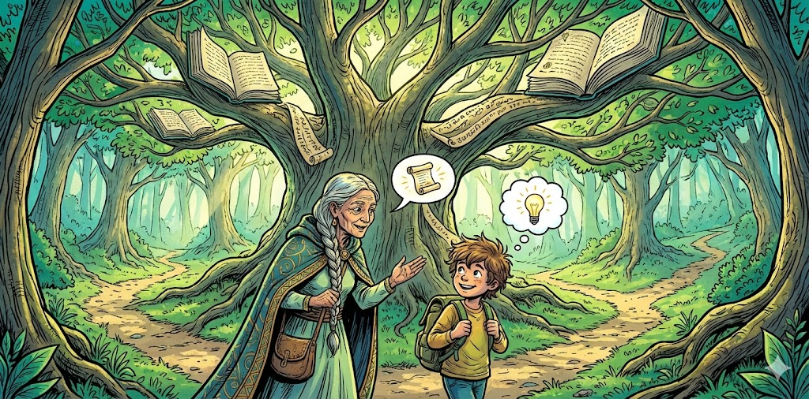

# From Sage to Guide

## Introduction

For more than a century, formal education has been organized around a central figure: the **teacher as the authoritative source of knowledge**, the person at the front of the room who transmits information to learners. This model—commonly described as the **“sage on the stage”**—assumes that expertise must be delivered through lecture, that knowledge moves in a single direction, and that learning involves absorbing curated explanations.

Over the past three decades, pedagogy has increasingly shifted toward more active, student-centered models. Alison King’s influential 1993 article introduced a phrase that came to define this transition: **“From Sage on the Stage to Guide on the Side.”**

In the era of **Intelligent Textbooks**, this transformation takes on renewed significance. With the rise of generative AI, graph-structured knowledge, adaptive simulations, embedded assessment, and always-available tutoring systems, the relationship between teachers, students, and content is profoundly changing. The teacher's role becomes more complex—not diminished—and the opportunities for personalization, exploration, and creative problem-solving expand dramatically.

This chapter explores the shift from “sage” to “guide,” situating it within the ecosystem of AI-augmented learning and the broader vision of connected knowledge frameworks described elsewhere in this book.

# 1. Historical Context: The Age of the Lecture

## 1.1 The Lecture as an Organizing Principle

For centuries, the lecture has been the dominant mode of instruction in higher education. Before the invention of the printing press, lectures were literally the only way to disseminate authoritative texts. Even today, the spatial choreography of classrooms—the front of the room, the chalkboard or projector, the rows of seats—reflects this lineage.

## 1.2 Assumptions of the “Sage on the Stage” Model

The lecture-centric model rests on several assumptions:

* **Knowledge is scarce**, and expertise must be distributed by an expert.
* **Student differences are minimal**; one pace fits all.
* **Content is fixed**, often tied to a printed textbook.
* **Assessment is episodic**, occurring after instruction.

These assumptions were historically defensible, given the limitations of technology, cost of materials, and absence of scalable instructional alternatives. But they no longer match what we know about cognition, nor do they reflect today’s digital learning landscape.

# 2. The Pedagogical Shift: “Guide on the Side”

## 2.1 King’s Core Insight

Alison King’s 1993 paper argued that learning is most effective when students actively construct knowledge—through questioning, connecting, and generating explanations. The instructor’s role shifts from **authoritative presenter** to **facilitator of inquiry**, designing situations where students ask better questions, test ideas, and engage with peers.

This shift aligns with:

* constructivist learning
* inquiry-based instruction
* cooperative learning
* metacognitive development

## 2.2 Misconceptions About the “Guide”

The “guide on the side” metaphor is often misinterpreted as advocating a passive, hands-off role. In practice, effective facilitation is highly active and sophisticated. Guides design learning environments, anticipate misconceptions, curate resources, and build scaffolds.

!!! note
    Facilitators are not less important—they are **more** important, because they orchestrate the entire learning ecosystem rather than merely delivering content.

# 3. The Intelligent Textbook Era: A New Teaching Ecology

In the AI-augmented classroom, neither the sage nor the guide is sufficient alone. Instead, we see the emergence of **distributed pedagogy**, where teachers, students, intelligent textbooks, simulations, assessment systems, and conversational agents all participate in the act of learning.

This transition draws directly on several concepts discussed elsewhere in this book, including:

* [Concept Dependency Graphs](concept-dependency-graphs.md)
* [Intelligent Simulations (MicroSims)](../sims/index.md)
* [Adaptive Assessments](adaptive-assessments.md)
* [Knowledge Graph Foundations](knowledge-graphs.md)

Together, these components transform the traditional instructional design triangle—teacher, learner, content—into a **dynamic knowledge network**.

# 4. Roles in an AI-Augmented Learning Ecosystem

## 4.1 The Teacher as Architect and Mentor

In intelligent textbook environments, the teacher becomes:

* a **curator** of high-quality resources
* a **coach** helping students navigate their own learning pathways
* a **systems thinker** who understands the interactions between tools, learners, and assessments
* a **humanizing force** providing motivation, empathy, and meaning-making

Rather than being the sole source of truth, teachers provide context, judgment, and direction.

## 4.2 The AI as Explainer, Generator, and Companion

Generative AI supports learners by providing:

* on-demand examples, analogies, diagrams, and proofs
* Socratic-style questioning and formative feedback
* language translation and accessibility support
* code generation or micro-lab scaffolds
* retrieval from structured knowledge graphs

AI augments human teaching but does not replace the deep relational and ethical aspects of mentorship.

## 4.3 Students as Active Navigators

Students move from passive listeners to **active agents**, constantly interacting with:

* simulations
* personalized problem sets
* embedded quizzes
* glossary-driven concept references
* multimodal explanations

Learners work within their **zone of proximal development (ZPD)**, supported both by AI tutors and human instructors.

# 5. Transformations in Learning Design

## 5.1 From Fixed Content to Dynamic Knowledge

A printed textbook is static: revisions are intermittent and expensive.
An intelligent textbook is:

* **adaptive** (content changes based on learner state)
* **contextual** (embedded definitions, concept links, and examples)
* **interactive** (MicroSims, animations, workflows)
* **data-informed** (via xAPI event streams)

## 5.2 From Linear Units to Concept Graphs

Traditional textbooks follow a linear sequence.

Intelligent textbooks instead rely on **concept dependency graphs** that allow learners to:

* explore concepts through multiple pathways
* diagnose gaps and misunderstandings
* visualize their learning progress
* adapt pacing dynamically

This aligns with modern cognitive science and systems thinking models emphasized throughout this book.

## 5.3 From Episodic Assessment to Continuous Insight

With embedded quizzes, error-detection algorithms, and AI-assisted feedback loops, assessment becomes **continuous and formative**. Teachers receive dashboards reflecting student mastery across the concept graph, allowing precise interventions.

# 6. System-Level Perspective: Educational Feedback Loops

Intelligent textbook systems introduce new feedback loops:

* **Learner ↔ AI**: instant feedback, refinement, and explanation
* **Learner ↔ Content**: exploration enhanced by simulations
* **Teacher ↔ AI**: insight dashboards and recommendations
* **Teacher ↔ Learner**: mentorship and strategy-building
* **Content ↔ Analytics**: continuous improvement and refinement

This is a shift from **pipeline thinking** (linear content delivery) to **systems thinking** (dynamic, interconnected learning ecosystems).

See also: [Systems Thinking](../concepts/systems-thinking.md).

# 7. Ethics, Equity, and Human Flourishing

AI-augmented learning introduces profound equity opportunities—and potential challenges.

## 7.1 Equity Gains

* 24/7 access to high-quality tutoring
* Personalized pacing that supports neurodiverse learners
* Multimodal representations that support visual thinkers, language learners, and students with disabilities
* Reduced dependence on variable instructor quality

## 7.2 Ethical Responsibilities

Developers and educators must ensure:

* transparency in AI reasoning
* safeguards against hallucination
* protection of learner privacy
* avoidance of bias
* clear role boundaries between AI and instructor

!!! warning
    Intelligent systems should **amplify** human flourishing, not erode autonomy or trust. Strong governance and transparent practices are essential.

# 8. Putting It All Together: A New Model for Teaching

The evolution from “sage on the stage” to “guide on the side” is not a rejection of expertise. It is a recognition that **expertise alone is insufficient** in an age when:

* knowledge is abundant
* simulations are immediate
* feedback is continuous
* learners are diverse
* adaptive AI is ubiquitous

Teachers become **designers of learning experiences**, **interpreters of meaning**, and **builders of communities**.

AI becomes the **scalable engine** that supports practice, exploration, and personalization.

Learners become **empowered participants** in a graph-shaped landscape of connected knowledge.

Together, they form a **new learning ecology** that defines the Intelligent Textbook.

---

# References

References in this section are sorted alphabetically by author last name.

Alberts, B. (2013). “Engaging in Inquiry-Based Science Teaching.” *Cell*, 152(6).

Bransford, J., Brown, A., & Cocking, R. (2000). *How People Learn: Brain, Mind, Experience, and School*. National Academy Press.

Brown, P. C., Roediger, H. L., & McDaniel, M. A. (2014). *Make It Stick: The Science of Successful Learning*. Harvard University Press.

Chi, M. T. H. (2009). “Active-Constructive-Interactive Framework for Differentiating Types of Active Learning.” *Topics in Cognitive Science*, 1(1).

Fischer, K. W., & Bidell, T. R. (2006). “Dynamic Development of Action and Thought.” In Damon, W. & Lerner, R. M. (Eds.), *Handbook of Child Psychology*. Wiley.

King, A. (1993). “From Sage on the Stage to Guide on the Side.” *College Teaching*, 41(1), 30–35.

Mayer, R. E. (2009). *Multimedia Learning*. Cambridge University Press.

National Research Council. (2012). *Education for Life and Work: Transferable Knowledge and Skills*. National Academies Press.

O’Neil, H. F. (Ed.). (2014). *Computer-Based Instruction and Intelligent Tutoring Systems*. Lawrence Erlbaum.

Rosenshine, B. (2012). “Principles of Instruction.” *American Educator*, 36(1), 12–20.

Sawyer, R. K. (Ed.). (2014). *The Cambridge Handbook of the Learning Sciences*. Cambridge University Press.

Siemens, G. (2005). “Connectivism: A Learning Theory for the Digital Age.”

U.S. Department of Education, Office of Educational Technology. (2017). *Reimagining the Role of Technology in Education*.

Wenger, E. (1998). *Communities of Practice: Learning, Meaning, and Identity*. Cambridge University Press.

