# From Moldy Books to a PhD: The Great Information Reincarnation

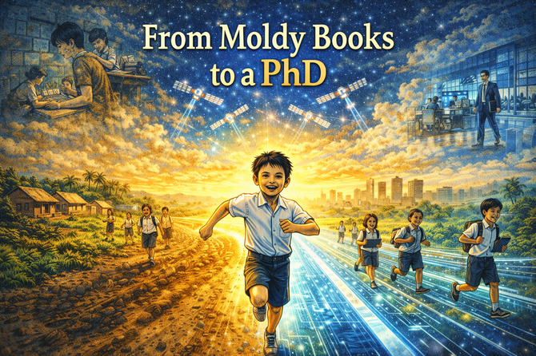

## Panel 1: The Humid Classroom
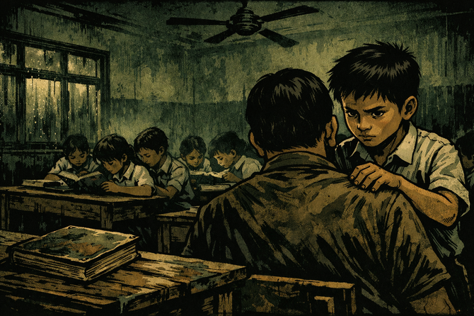

Please generate a wide-landscape image with a width to height ratio of 16:9.
Use a graphic-novel style rendering with a dark palette dominated by deep forest greens, murky browns, and shadowy blacks.

A cramped Indonesian elementary school classroom in 1990. The walls are water-stained concrete painted a faded institutional green. Humidity visibly hangs in the air like a mist. Wooden desks are packed tightly together. In the foreground, a young boy of about ten years old stands behind a seated teacher, his small hands pressing into the teacher's shoulders in a massage. The boy's eyes, however, are not on the teacher—they are fixed intensely on a single weathered textbook lying on a nearby desk. Ceiling fans spin slowly overhead but do nothing against the oppressive heat. Condensation drips down the windows. Other students sit cramped together, two or three to a desk, all sharing worn books.

[Surabaya Indonesia](https://en.wikipedia.org/wiki/Surabaya), 1990. The air was so thick with humidity you could taste the monsoon before it arrived. Young Hadi stood behind his teacher, small fingers kneading tired shoulders—this was respect, this was how you earned the right to learn. But his eyes never left the desk. There, between him and three other students, sat the most precious object in the room: the textbook. It wasn't just old. It was alive.

---

## Panel 2: The Moldy Textbook
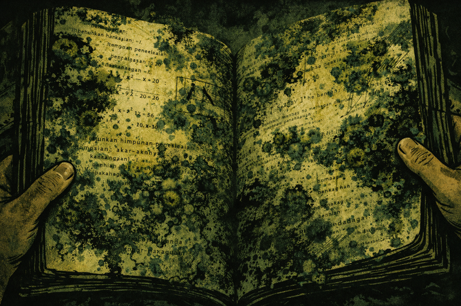

Please generate a wide-landscape image with a width to height ratio of 16:9.
Use a graphic-novel style rendering with dark greens, blacks, and sickly yellow-green highlights suggesting decay.

An extreme close-up of hands holding open a textbook ravaged by tropical mold. The pages are warped and rippled from moisture. Black and green fungal colonies spread across the paper like alien continents, obscuring mathematical equations and diagrams. Fingers—small, belonging to a child—carefully hold the pages open, trying to read around the biological invasion. The mold has textures: fuzzy patches, slick wet spots, dried crusted areas. Some pages are stuck together. The visible text shows Indonesian language and math problems, partially eaten away by decay.

This wasn't a textbook—it was a biological experiment. Black and green mold colonized every page, thriving in the humidity that turned paper into petri dishes. The Buku Paket system meant these books belonged to the state, not to students. They were handed out, shared among four children, and returned at year's end. No one owned knowledge back then. You merely rented it, one moldy page at a time.

---

## Panel 3: The Moldy Mosaic Strategy
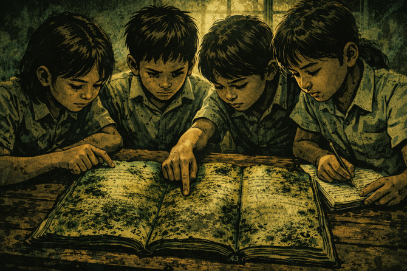

Please generate a wide-landscape image with a width to height ratio of 16:9.
Use a graphic-novel style rendering with deep jungle greens, warm browns, and slight golden highlights where hope breaks through.

Four Indonesian schoolchildren huddled closely around two moldy textbooks laid side by side on a wooden desk. They are engaged in intense collaboration—pointing at different pages, comparing content. One book is open to page 42, clearly obscured by mold. The other is open to page 43, also damaged but in different places. The children's faces show concentration and ingenuity rather than defeat. One child traces a finger along readable text while another writes in a worn notebook. Afternoon light filters through dirty windows, casting dramatic shadows.

Page 42 was unreadable in Hadi's book—consumed by fungi. But his deskmate's copy had lost page 43 to the same enemy. So they became partners in a scavenger hunt for knowledge, cross-referencing their "moldy mosaics" to piece together a single complete homework set. There was no Google. No search engine. Just luck—hoping the mold hadn't devoured the same paragraph twice. This was survivalist learning.

---

## Panel 4: Wrapping the Books
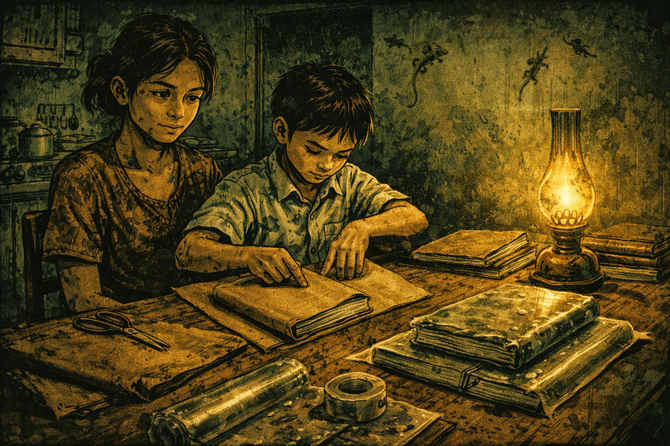

Please generate a wide-landscape image with a width to height ratio of 16:9.
Use a graphic-novel style rendering with earthy browns, deep greens, and amber lamp light creating warmth against shadows.

A kitchen table scene at night in a modest Indonesian home. A young boy carefully wraps a textbook in brown paper (sampul cokelat), his mother watching nearby. On the table: scissors, a roll of clear plastic sheeting, tape, and several books in various stages of being covered. The process is ritualistic, methodical. The irony is visible—moisture is already trapped under the plastic of a previously covered book, creating condensation bubbles. Kerosene lamp light casts warm amber glows. Geckos cling to the walls. The room is humble but clean.

Every year brought the ritual of *Sampul Buku*—the sacred covering of borrowed books. Brown paper first, then clear plastic to protect against the rain. But here was the cruel irony: the plastic trapped the humidity inside, accelerating the very mold it was meant to prevent. The paper couldn't breathe. The books slowly suffocated, and with them, the dreams of countless students who would inherit these decaying vessels of knowledge.

---

## Panel 5: A Glimpse Beyond
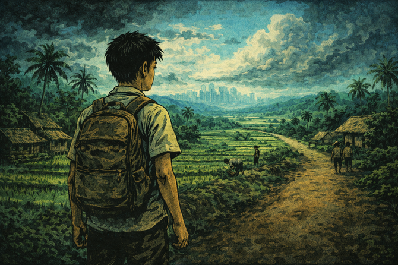

Please generate a wide-landscape image with a width to height ratio of 16:9.
Use a graphic-novel style rendering transitioning from dark greens to include teals and hints of blue sky.

A teenage Hadi stands at the edge of his village, looking out toward a distant cityscape barely visible on the horizon. Behind him: the familiar world of palm trees, rice paddies, modest homes, and the deep greens of Indonesia. Before him: the unknown. He carries a worn backpack. The sky is beginning to clear—storm clouds retreating to reveal patches of blue. His posture suggests both fear and determination. Other villagers go about their daily work in the background, unaware of the journey he is about to begin. A dirt road stretches ahead.

No one in Hadi's family had finished middle school. There were no maps for what came next—no legacy advice, no insider tips, no shoulders to stand on. Just a boy from Surabaya staring at a horizon he'd only read about in moldy books. The jungle of his childhood was thick with vines, but somewhere beyond those trees lay universities, laboratories, futures. He would have to cut through every single one himself.

---

## Panel 6: Arrival in America
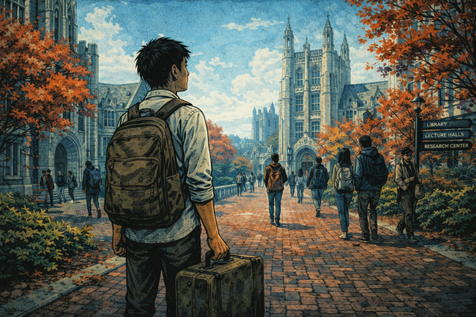

Please generate a wide-landscape image with a width to height ratio of 16:9.
Use a graphic-novel style rendering with cool blues, grays, and sterile whites contrasting with the warm tones of previous panels.

An American university campus in autumn. A young adult Hadi stands with a single suitcase on a brick pathway, looking up at towering collegiate Gothic buildings. Maple trees display red and orange leaves. Students walk past in groups, confident and casual. Hadi's expression mixes wonder with displacement—he's clearly processing an entirely new world. The architecture is grand, intimidating. Signs point to libraries, lecture halls, research centers. The sky is crisp blue. Everything is clean, organized, impossibly different from the humid classrooms of his childhood.

Twenty years and ten thousand miles from the moldy textbooks, Hadi stood on American soil. The university campus stretched before him like another planet—brick and stone, autumn leaves, students carrying books that weren't rotting. To the world, he was becoming a scholar. To himself, he was still that kid from Surabaya, only now he was hacking through a different kind of jungle. No map. No guide. Just full jungle discovery mode.

---

## Panel 7: The Academic Struggle
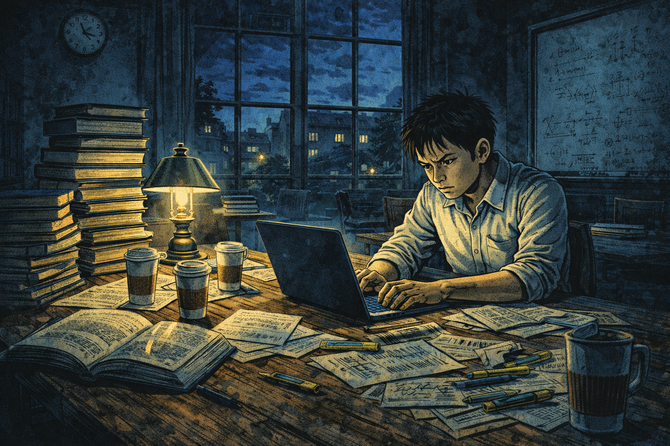

Please generate a wide-landscape image with a width to height ratio of 16:9.
Use a graphic-novel style rendering with midnight blues, library lamp gold, and determined expressions cutting through shadow.

A university library at night. Hadi sits alone at a large wooden table surrounded by towers of pristine textbooks and academic papers. His laptop glows. Empty coffee cups accumulate. Other seats are vacant—he's the last one there. The clock shows 2 AM. His face shows exhaustion but fierce determination. Through tall windows, the campus is dark except for scattered lights. Notes and highlighters spread across the table. On a nearby whiteboard, complex equations and research diagrams are partially visible. This is the late-night grind of graduate school.

Every syllabus was a vine to cut through. Every grant application, a wall to scale. Every networking event, a foreign language spoken by people who had inherited the decoder ring at birth. The PhD wasn't given—it was excavated, night after sleepless night, from a mountain of papers and prejudices. But somewhere inside that library, the boy who once pieced together homework from moldy fragments was forging something new: expertise that couldn't be eaten by fungi.

---

## Panel 8: The PhD Moment
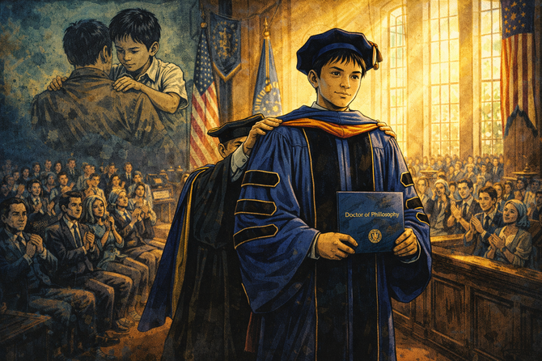

Please generate a wide-landscape image with a width to height ratio of 16:9.
Use a graphic-novel style rendering with brighter colors emerging: royal blues, gold accents, celebration warmth.

A university graduation ceremony. Hadi walks across a grand stage in full doctoral regalia—the velvet stripes, the tam cap, the ceremonial hood being placed over his shoulders by a professor. The audience applauds. Light streams through tall windows. The doctoral diploma is visible. His expression is one of quiet triumph mixed with disbelief—the impossible has happened. In a ghostly, semi-transparent overlay in one corner of the image, we see a faint image of young Hadi massaging the teacher's shoulders, connecting past to present. American and university flags hang in the background.

Dr. Hadi. The words felt impossible even as they became real. The boy whose family never finished middle school now wore the velvet stripes of academia's highest achievement. But this wasn't an ending—it was a transformation. The humidity of that 1990s classroom still lived in his memory, and with it, a question that would drive everything that came next: what about the millions of children still sharing moldy books?

---

## Panel 9: The Fortune-50 Leader

Please generate a wide-landscape image with a width to height ratio of 16:9.
Use a graphic-novel style rendering with corporate blues, silver, and bright whites suggesting modern technology and success.

A massive modern corporate headquarters—glass and steel architecture gleaming in sunlight. Hadi, now in his forties, walks through a sleek lobby wearing business attire. Digital screens display data visualizations. The company logo suggests a Fortune-50 tech giant. Behind him, teams of software developers collaborate at standing desks visible through glass walls. The scale is impressive—this is a company employing over 40,000 developers. Hadi carries a tablet, walking with the confident stride of a leader. Natural light floods the space. The palette is bright, optimistic, technological.

Today, Hadi leads data science for a Fortune-50 company—forty thousand software developers, billions of data points, decisions that ripple across the global economy. From massaging a teacher's shoulders to architecting the nervous system of a corporate giant. But success had sharpened, not dulled, his memory. Every algorithm he designed was haunted by a ghost: a ten-year-old in Surabaya, squinting at fungal-covered equations.

---

## Panel 10: The Vision
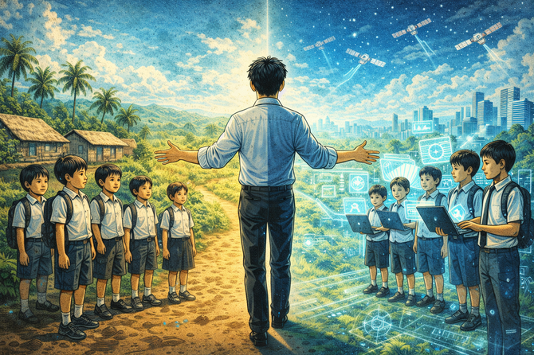

Please generate a wide-landscape image with a width to height ratio of 16:9.
Use a graphic-novel style rendering with hopeful colors: bright greens (not the dark jungle greens), sky blues, golden light.

Split composition showing past and future. On the left side: a remote Indonesian village—simple homes, palm trees, children in school uniforms. On the right side: those same children but now holding tablets and laptops, with holographic or glowing educational content emanating from the screens. In the center, connecting both worlds, Hadi stands as a bridge figure, one hand reaching toward each reality. Starlink-style satellites orbit overhead in a bright blue sky. The palette transitions from the earthy greens of the village to the technological blues of the digital future. Hope radiates from the image.

The walls have crumbled. A child in a remote Indonesian village can now sit in the same virtual front row as a billionaire's son at MIT. They don't need a local hero—they can study the mental models of the world's greatest minds in real-time. With low-cost devices and internet connections spreading like dawn across the archipelago, the infrastructure excuse is vanishing. The moldy book era is dying. What rises in its place is something Hadi never dared to dream.

---

## Panel 11: The AI Teacher
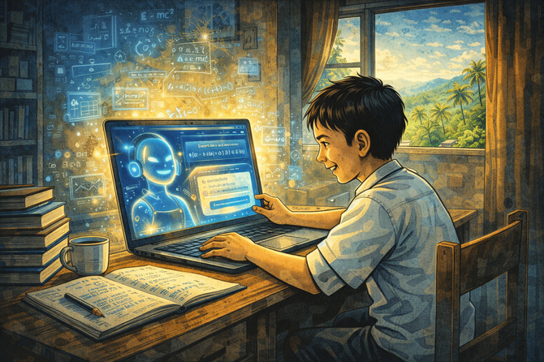

Please generate a wide-landscape image with a width to height ratio of 16:9.
Use a graphic-novel style rendering with bright, optimistic colors: warm golds, electric blues, hopeful whites.

An Indonesian child sits at a simple desk in a modest home, engaged with an intelligent textbook on a laptop screen. The AI interface glows warmly, showing adaptive content, equations, and encouraging feedback. The child's face is lit with understanding—the "aha moment" captured perfectly. Unlike the old teacher who demanded shoulder massages, this AI teacher is patient, tireless, always available. In subtle visual echoes around the room, ghostly mathematical formulas and educational content float like friendly spirits. The child's notebook shows neat work. Outside the window: the familiar tropical landscape, but now connected to the world.

AI is the teacher who never tires, never demands respect through ritual, never withholds knowledge behind mold and scarcity. It answers every question without judgment, adapts to every student's pace, generates new content tuned precisely to need. The intelligent textbook doesn't rot. It doesn't discriminate by village or family wealth. It simply gives light to anyone brave enough to ask.

---

## Panel 12: The Only Limit

Please generate a wide-landscape image with a width to height ratio of 16:9.
Use a graphic-novel style rendering with the brightest palette yet: sunrise golds, electric blues, vibrant greens of growth, inspirational warmth.

A powerful composite image. In the foreground, an Indonesian child runs forward on a path that transforms from muddy village road into a gleaming digital highway. Above: Starlink satellites creating a constellation of connectivity. To the sides: ghostly images of Hadi's journey—the moldy classroom, the wrapped books, the university library, the corporate headquarters—fading into the background as they're left behind. Before the child: an open horizon glowing with possibility. The child's expression is pure determination and joy. Other children from diverse backgrounds run alongside on parallel paths. The message is clear: the jungle has been paved.

The jungle has been paved. The only thing standing between a child in a Surabaya alleyway and a PhD in the Ivy League is the courage to ask the right questions. The bottleneck is no longer the book—it is no longer the infrastructure, the teacher, or the family legacy. The bottleneck is now the mind, the will, the prompt. For Hadi, this is the great information reincarnation: the death of scarcity, the birth of possibility. Now, the only question is—how fast can you run?

---

*Warm Regards,*
*Hadi*

## References

- [History of Education in Indonesia](https://en.wikipedia.org/wiki/Education_in_Indonesia#Post_independence) - Wikipedia

-   [Buku Ajar (Indonesian School Textbooks)](https://id.wikipedia.org/wiki/Buku_ajar) -- n.d. -- Wikipedia (Indonesian) -- Overview of the government textbook system.  Note that in the 1990 the government issued *Buku Paket* textbook system in Indonesia. Textbooks were owned by the state, loaned to students, reused annually, and often shared. This directly grounds the story's depiction of moldy, heavily reused books and the idea that students "rented" knowledge rather than owning it.

-   **[Policy on Government-Provided Textbooks (Buku Sekolah Elektronik / Buku Paket)](https://pusbuk.kemdikbud.go.id/)** -- updated periodically -- Indonesian Ministry of Education and Culture (Kemendikbud) -- Official documentation and policy background on state-provided textbooks, including procurement, distribution, and reuse. This reference explains the institutional context behind why physical textbooks were scarce, standardized, and reused across generations of students, as portrayed in the early panels.

-   **[Textbook Provision and Quality Challenges in Indonesian Basic Education](https://documents.worldbank.org/en/publication/documents-reports/documentdetail/)** -- 2008 -- World Bank -- Analysis of Indonesia's basic education system, including textbook availability, quality, logistics, and environmental challenges such as humidity and storage. This report helps explain why physical decay, mold, and uneven access were persistent problems---conditions that shaped Hadi's early learning environment and motivated the story's emphasis on digital alternatives.